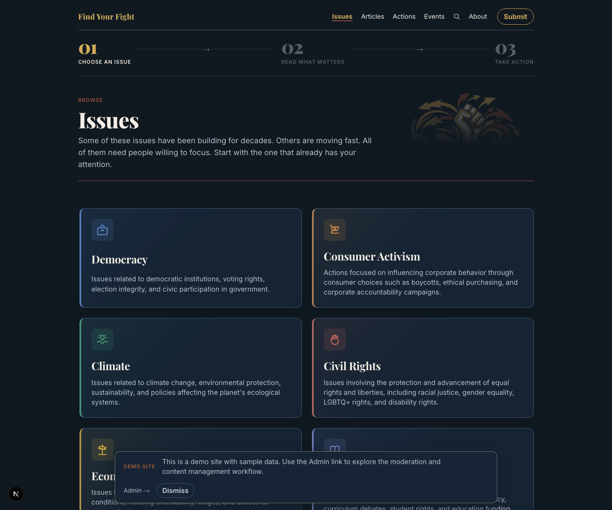
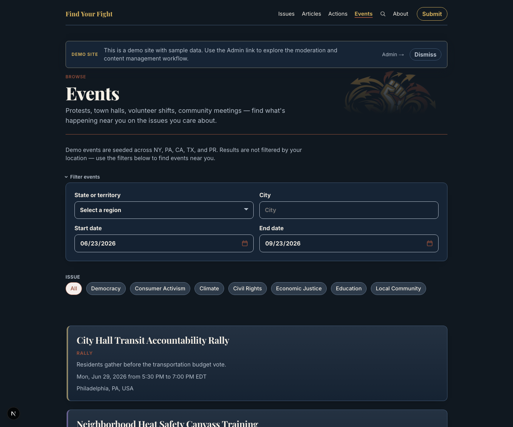
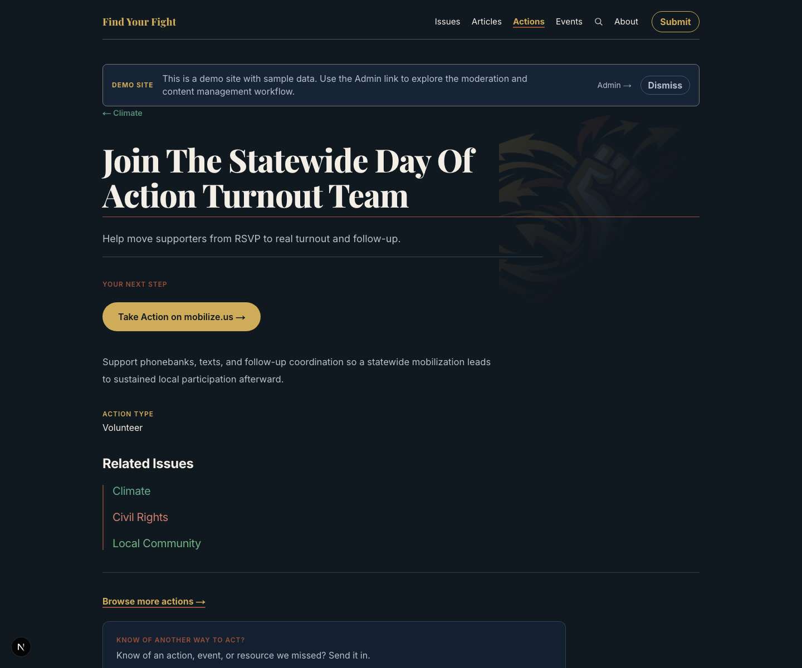
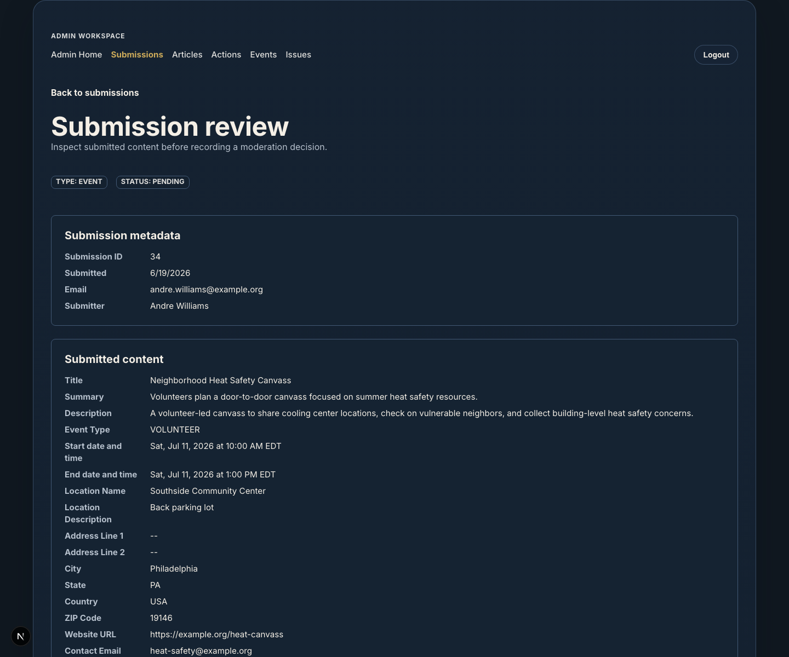

# SignalFire (Product: Find Your Fight)

SignalFire is a full-stack civic action platform built for release-quality
content discovery and moderation workflows. The public product identity is
**Find Your Fight**.

It helps people move from issue understanding to concrete civic participation
through Topics, Articles, Actions, and Events.

## Portfolio Snapshot

What this repository demonstrates:

- end-to-end product implementation across frontend, backend, and data model
- structured civic content discovery with cross-linked public resources
- community submission pipeline with moderation review and publication mapping
- documented architecture, phased delivery, and engineering decisions
- test coverage across UI, API contracts, and backend behavior

## Current Scope

Implemented areas:

- public discovery through Topics, Articles, Actions, and Events
- article and event submission flows
- moderation queue and review actions for submissions
- editorial normalization before approval
- publication mapping from approved submissions into public records
- deployed admin authentication and access control
- demo seed content for portfolio/screenshot review

## Roadmap

### Milestone 1

Milestone 1 is a portfolio-quality deployed demo:

- polished public discovery experience
- end-to-end article and event submission flows
- moderation queue, review actions, and editorial normalization
- admin authentication and protected internal workflow
- intentional demo posture for public-site and repo reviewers

This is the current repository goal. It is about shipping a credible product
artifact, not proving real-user growth.

### Milestone 2

Milestone 2 is a product decision: whether and how `Find Your Fight` evolves
from a portfolio artifact into a real public product.

Several gaps currently stand between this demo and a live product:

**Content relationships are seed-managed.** The public site shows curated
article ↔ action links that demonstrate the intended editorial ideal — read
about an issue, then take a specific action on it. Those links exist only
because the demo seed created them. There is no admin UI or submitter pathway
to create these connections in practice. This is the most important editorial
workflow gap to close before the platform can operate without manual database
intervention. See `docs/future/milestone-2-planning-notes.md` for candidate
approaches.

**The contributor loop is incomplete.** Community members who submit articles
or events receive no feedback. There is no submission status email, no
rejection notice, no confirmation that their contribution reached a real
person. This gap makes it difficult to build a recurring contributor base.

**Event discovery at scale requires ingestion.** The current event model
assumes manual admin entry or community submission. A real-user product needs
a crawler that pulls from curated civic sources (local government calendars,
Mobilize, Eventbrite topic searches) and feeds candidates into the existing
moderation queue.

**Editorial inventory precedes community.** The site currently relies on seed
content. Submissions are unlikely to arrive organically on an empty site.
A credible Milestone 2 launch requires enough editorial inventory to give
first visitors a reason to return and contribute.

For the fuller roadmap, see `docs/specs/002-roadmap.md`.

## Architecture

pnpm monorepo:

- `apps/web`: Next.js App Router frontend
- `apps/api`: NestJS backend API
- `packages/api-contracts`: shared request/response contracts
- `docs/specs`: product and feature specs
- `docs/architecture`: architecture notes and implementation contracts
- `docs/agent-governance`: roadmap, decisions, and AI collaboration rules
- `docs/learnings`: implementation guides and walkthroughs

Public routes use server-rendered fetching for initial content. Browser-side API
calls handle post-load actions such as submissions and moderation actions.

## Requirements

- Node.js `24.4.0` (matches `.nvmrc`)
- pnpm `10.30.3`
- Docker or another local PostgreSQL option for database-backed development

## Quick Start (Portfolio Review)

```bash
pnpm install
docker-compose up -d
cp apps/api/.env.example apps/api/.env
cp apps/web/.env.local.example apps/web/.env.local
pnpm api:prisma:migrate:dev
pnpm api:prisma:migrate:seed
pnpm api:prisma:migrate:seed:demo
pnpm dev
```

Notes:

- `apps/api/.env.example` defaults to baseline seeding; the demo seed command
  overrides that explicitly for local portfolio/demo review.
- `apps/web/.env.local.example` enables public demo mode by default so the
  banner, badge, and `Admin Demo` entry point are visible in review builds.

Run only baseline seed (without demo content):

```bash
pnpm api:prisma:migrate:seed
```

Local ports:

- web: `http://localhost:3000`
- API: `http://localhost:3001`

## Useful Commands

```bash
pnpm build
pnpm lint
pnpm typecheck
pnpm test
pnpm --filter web test
pnpm --filter api test:unit
pnpm --filter api test:integration
pnpm --filter api test:e2e
```

API e2e tests use Testcontainers and require a working local container runtime.
Screenshot refresh uses:

```bash
pnpm docs:screenshots
```

## Screenshots










## Demo Review and Admin Access

Demo seed mode creates Articles, Actions, Events, relationships, and moderation
submissions suitable for local portfolio review and screenshots. It also creates
a demo admin user for the `/admin` area:

- email: `admin@example.com`
- password: `FindYourFight1`

Override during the demo seed run if needed:

```bash
ADMIN_EMAIL=reviewer@example.com ADMIN_PASSWORD=change-me pnpm api:prisma:migrate:seed:demo
```

Enable the public demo treatment in `apps/web/.env.local`:

```bash
NEXT_PUBLIC_ENABLE_DEMO_MODE=true
```

Without that flag, the public demo badge, banner, and header `Admin Demo` entry
do not render.

Suggested reviewer path:

1. Start on the homepage to understand the public demo posture
2. Browse Issues, Articles, Actions, or the Event finder
3. Click **Admin Demo** in the header — this opens the `/demo` page with admin access instructions and credentials
4. Log into the admin workspace to review moderation queue, submission review, and content-management flows

Milestone 1 release-readiness notes, checklist, deferred items, and admin-boundary
history live in:

- `docs/specs/016-phase-13-milestone-1-release-readiness.md`

## Planning Docs

Canonical planning and decision docs:

- `docs/specs/002-roadmap.md`
- `docs/agent-governance/progress.md`
- `docs/agent-governance/decisions.md`

Current active implementation phase is Phase 14.7: Continuity Pass.

## Key Repo Entry Points

If you are reviewing the repository rather than running the app first, start
here:

- `README.md` - setup, scope, demo access, and review flow
- `docs/specs/001-release1-scope.md` - current product scope
- `docs/specs/002-roadmap.md` - milestone framing beyond Release 1
- `docs/specs/016-phase-13-milestone-1-release-readiness.md` - release checklist, deferreds, and launch-readiness notes
- `docs/architecture/001-system-architecture.md` - system structure
- `docs/agent-governance/progress.md` - current implementation phase and completion status

## Admin Deployment Caveat

The admin/moderation source code is part of this repository, but deployment to
any environment intended for real users requires authentication and
authorization before exposing admin routes.

Making the source repository public does not mean the application is ready for a
public production deployment.

## License and Contributions

This repository is source-available for portfolio review only.

- all rights are reserved by the author
- no permission is granted to copy, modify, redistribute, or deploy this code
- external contributions are not being solicited at this stage

See `LICENSE` for full terms.
