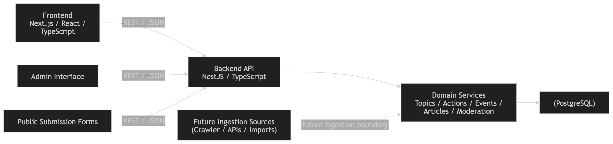
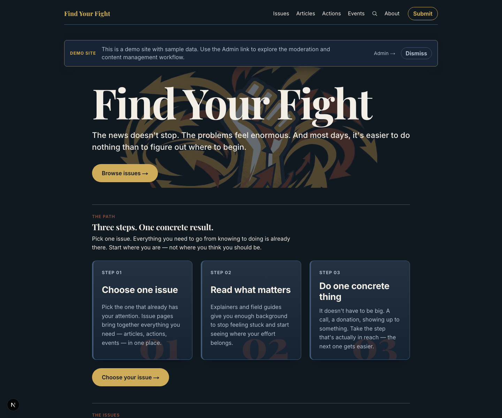
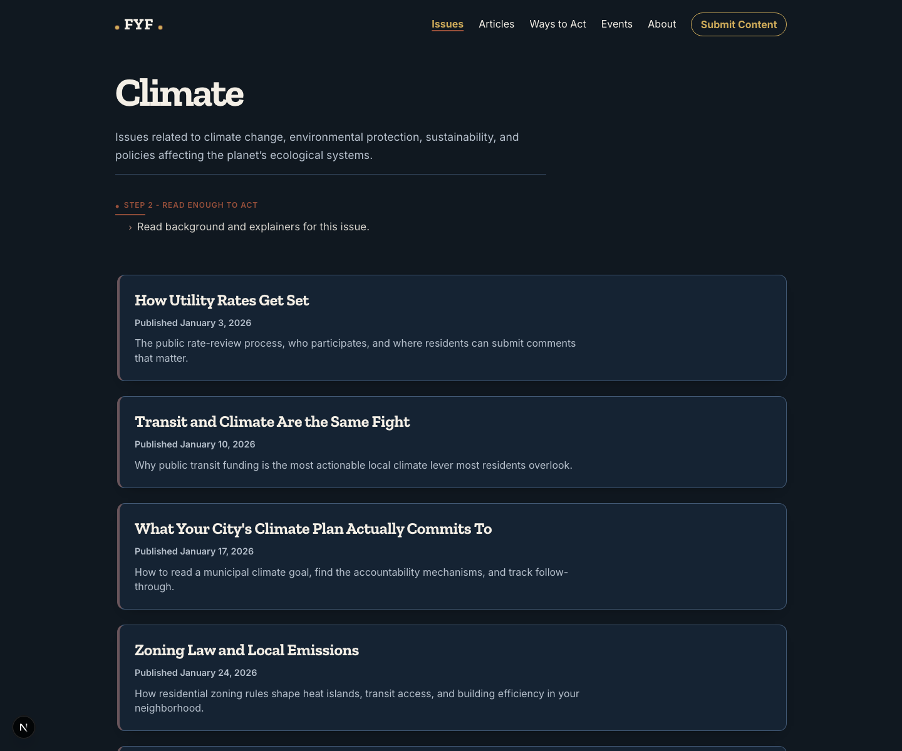
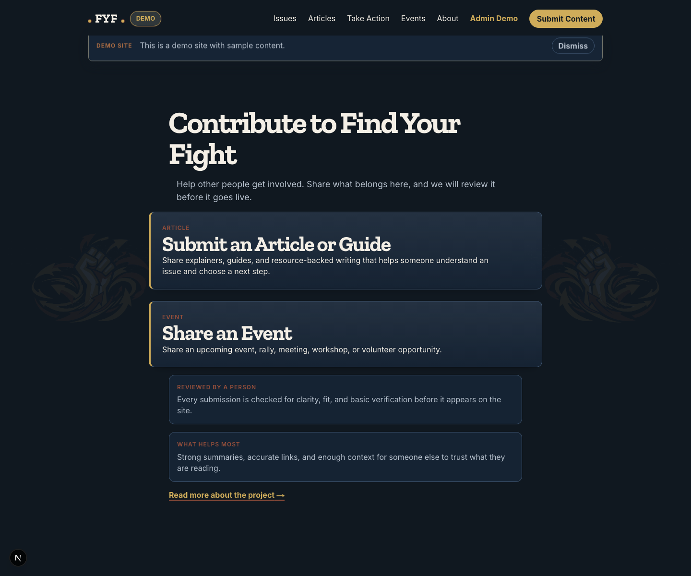
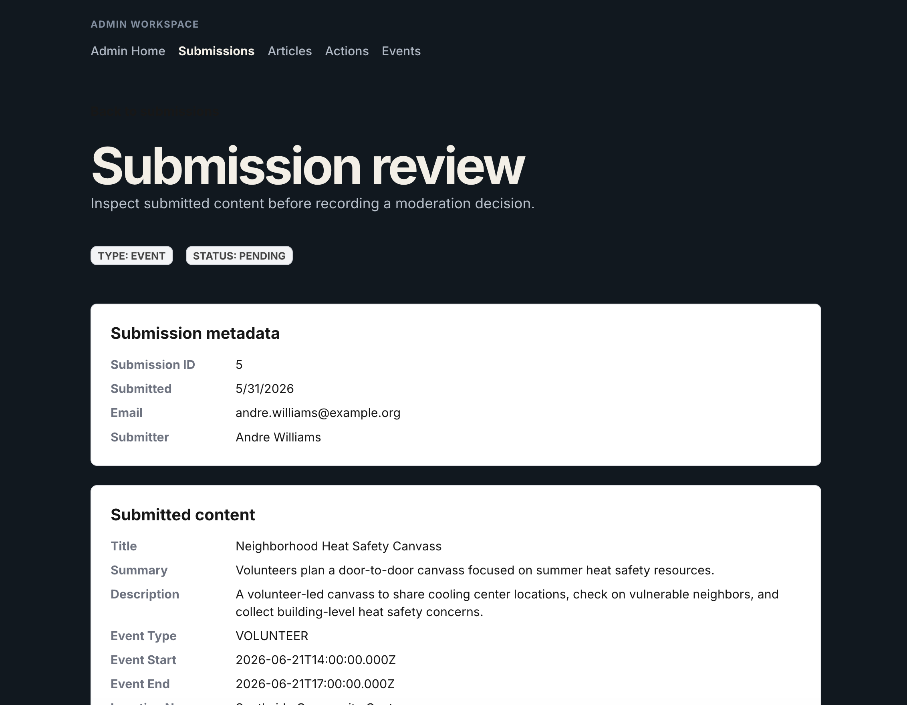

# SignalFire (Product: Find Your Fight)

SignalFire is a full-stack civic action platform built for release-quality
content discovery and moderation workflows. The public product identity is
**Find Your Fight**.

It helps people move from issue understanding to concrete civic participation
through Topics, Articles, Actions, and Events.

## Portfolio Snapshot

What this repository demonstrates:

- end-to-end product implementation across frontend, backend, and data model
- structured civic content discovery with cross-linked public resources
- community submission pipeline with moderation review and publication mapping
- documented architecture, phased delivery, and engineering decisions
- test coverage across UI, API contracts, and backend behavior

## Current Scope

Implemented areas:

- public discovery through Topics, Articles, Actions, and Events
- article and event submission flows
- moderation queue and review actions for submissions
- editorial normalization before approval
- publication mapping from approved submissions into public records
- deployed admin authentication and access control
- demo seed content for portfolio/screenshot review

Not included in Release 1:

- public user accounts
- social feed/comment features
- production deployment hardening
- topic CRUD beyond seeded Release 1 topics

## Architecture

pnpm monorepo:

- `apps/web`: Next.js App Router frontend
- `apps/api`: NestJS backend API
- `packages/api-contracts`: shared request/response contracts
- `docs/specs`: product and feature specs
- `docs/architecture`: architecture notes and implementation contracts
- `docs/agent-governance`: roadmap, decisions, and AI collaboration rules
- `docs/learnings`: implementation guides and walkthroughs

Public routes use server-rendered fetching for initial content. Browser-side API
calls handle post-load actions such as submissions and moderation actions.

## Requirements

- Node.js compatible with the repo toolchain
- pnpm `10.30.3`
- Docker or another local PostgreSQL option for database-backed development

## Quick Start (Portfolio Review)

```bash
pnpm install
docker-compose up -d
cp apps/api/.env.example apps/api/.env
cp apps/web/.env.local.example apps/web/.env.local
pnpm api:prisma:migrate:dev
pnpm api:prisma:migrate:seed
pnpm api:prisma:migrate:seed:demo
pnpm dev
```

Run only baseline seed (without demo content):

```bash
pnpm api:prisma:migrate:seed
```

Local ports:

- web: `http://localhost:3000`
- API: `http://localhost:3001`

## Useful Commands

```bash
pnpm build
pnpm lint
pnpm typecheck
pnpm test
pnpm --filter web test
pnpm --filter api test:unit
pnpm --filter api test:e2e
```

API e2e tests use Testcontainers and require a working local container runtime.

## Visual Review Assets

Architecture diagram:



Featured screenshots:

**Home (Hero)**


**Issue Detail**


**Submit Entry**


**Submission Review (Decision)**


<details>
  <summary>All screenshots</summary>

- [Home (Hero)](docs/screenshots/01-home.png)
- [Home (Lower Sections)](docs/screenshots/01b-home-lower.png)
- [Issues Index](docs/screenshots/02-topics-index.png)
- [Issue Detail](docs/screenshots/03-topic-detail.png)
- [Article Detail](docs/screenshots/04-article-detail.png)
- [Events Index](docs/screenshots/05-events-index.png)
- [Submit Entry](docs/screenshots/06-submit-entry.png)
- [Admin Submissions Queue](docs/screenshots/07-admin-submissions-queue.png)
- [Submission Review](docs/screenshots/08-submission-review.png)
- [Submission Review (Decision)](docs/screenshots/08-submission-review-decision.png)

</details>

## Demo Review

Demo seed mode creates Articles, Actions, Events, relationships, and moderation
submissions suitable for local portfolio review and screenshots. It also creates
a demo admin user for the `/admin` area:

- email: `admin@example.com`
- password: `FindYourFight1`

Override during the demo seed run if needed:

```bash
ADMIN_EMAIL=reviewer@example.com ADMIN_PASSWORD=change-me pnpm api:prisma:migrate:seed:demo
```

## Roadmap and Decisions

The canonical roadmap is:

- `docs/agent-governance/progress.md`
- `docs/agent-governance/decisions.md`

Current milestone focus is Phase 11.6: public repository readiness after the
Phase 11.5 public experience refresh.

## Admin Deployment Caveat

The admin/moderation source code is part of this repository, but deployment to
any environment intended for real users requires authentication and
authorization before exposing admin routes.

Making the source repository public does not mean the application is ready for a
public production deployment.

## License and Contributions

This repository is source-available for portfolio review only.

- all rights are reserved by the author
- no permission is granted to copy, modify, redistribute, or deploy this code
- external contributions are not being solicited at this stage

See `LICENSE` for full terms.
