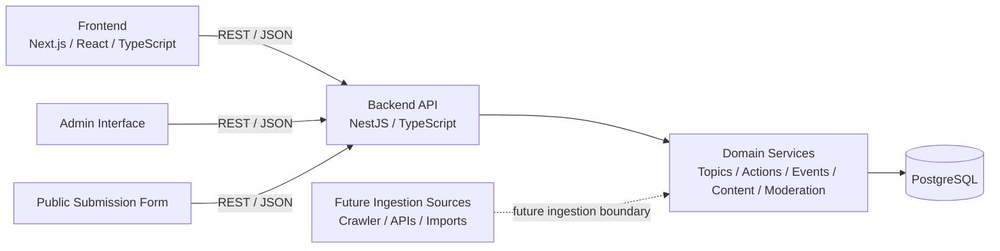

# System Architecture

## Purpose

Define the high-level architecture and system boundaries so implementation
decisions remain consistent throughout development.

This document describes **how major system components interact**, not the
low-level implementation details.

---

## System Overview

SignalFire is a **civil action platform** that helps users understand issues
and participate in civic action.

The platform connects three primary content types:

- **Actions** – things people can do
- **Events** – time/location based participation opportunities
- **Articles** – informational or educational content

These objects are organized around **Topics**, which represent the major
issues or causes users care about.

Example topics:

- climate
- labor
- housing
- voting rights
- education

The system consists of:

- Public web client
- Backend API service
- PostgreSQL database
- Administrative moderation interface

---

## High-Level System Diagram

- Frontend serves the public site.
- Admin interface uses the same backend.
- Backend owns domain logic and persistence.
- PostgreSQL stores events, content, and moderation data.
- Future ingestion sources plug into domain services rather than directly into the database.

Static image

---

## Core Architectural Principles

### Clear frontend/backend separation

- UI logic lives in the frontend
- domain and persistence logic live in the backend

### Domain-driven modeling

Core entities are modeled explicitly:

- Topic
- Action
- Event
- Article
- Submission

### Implementation transparency

- Human-written code
- AI assists with reasoning and review

### Future extensibility

Architecture must support:

- event ingestion
- additional content types
- user accounts (future)

without requiring redesign.

---

## Primary Components

### Frontend

Technology:

- Next.js
- React
- TypeScript

Responsibilities:

- topic browsing
- action discovery
- event discovery
- article reading
- event/article submission forms

---

### Backend

Technology:

- NestJS
- TypeScript

Responsibilities:

- domain APIs
- topic/action/event/article retrieval
- submission handling
- moderation workflows
- validation and persistence

---

### Database

Technology:

- PostgreSQL

Responsibilities:

- store topics
- store actions
- store events
- store articles
- store submissions and moderation status

Long-form content will be stored using PostgreSQL `TEXT` or `JSONB`.

---

## Core Domain Objects

### Topic

Represents an issue or cause users care about.

Topics organize the platform’s information and discovery model.

Examples:

- climate
- labor rights
- housing justice

Topics may reference:

- actions
- events
- articles

---

### Action

A concrete step a user can take.

Examples:

- contact your representative
- boycott a company
- attend a protest
- donate to an organization

Actions are **admin-curated** in Release 1.

---

### Event

A time-bound civic activity.

Examples:

- protest
- town hall
- volunteer event
- organizing meeting

Events may be submitted by users and moderated before publication.

---

### Article

Long-form informational content.

Examples:

- issue explainers
- guides
- educational posts

Articles help users understand issues and discover actions.

---

### Submission

Represents user-submitted content awaiting moderation.

In Release 1 users may submit:

- events
- articles

Actions remain admin-only.

---

## Domain Boundaries

Initial domains:

- Topic
- Action
- Event
- Article
- Submission / Moderation

These domains define the core platform capabilities.

---

## Ingestion Boundary

Release 1 **does not include automated event crawling**.

Future ingestion modules may introduce:

- crawler integrations
- external APIs
- batch imports

Ingestion will integrate through backend services rather than writing
directly to the database.
