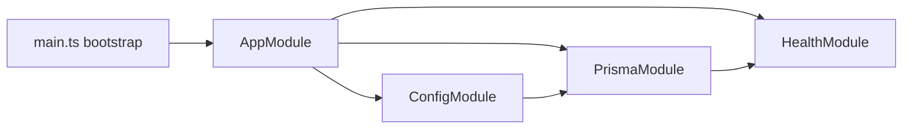

# Backend Foundations (Phase 2)

## Purpose

Define the minimum backend foundation boundaries for Phase 2 so Phase 3 can start without ambiguity.

## Phase 2 Modules

- `AppModule`
  - Composition root only.
  - Wires foundation modules and does not own business logic.
- `ConfigModule`
  - Owns runtime configuration initialization and validation.
  - Defines required environment contract (`DATABASE_URL`, `PORT`, `NODE_ENV` defaults/validation).
- `PrismaModule`
  - Owns database client lifecycle and DB access boundary for backend modules.
  - No domain persistence contracts are finalized in this module during Phase 2.1.
- `HealthModule`
  - Owns operational health endpoints (liveness/readiness).
  - Exposes service health, not domain/business endpoints.

## Ownership Boundaries

- Config concerns stay in `ConfigModule`; other modules consume validated config.
- Database client concerns stay in `PrismaModule`; domain repositories/services are Phase 3.
- Operational availability checks stay in `HealthModule`.
- `AppModule` coordinates imports and should not become a feature module.

## Out Of Scope Until Phase 3

- Core domain schema decisions for `Topic`, `Article`, `Action`, `Event`, `Submission`.
- Domain-specific repositories/services/controllers.
- Release 1 feature endpoints beyond backend foundation operations.
- Any persistence design that locks in final domain relationships.

## Config, Prisma, and Health Interaction

1. App bootstrap loads `AppModule`.
2. `ConfigModule` initializes first and validates runtime configuration.
3. `PrismaModule` uses validated config to initialize DB client connectivity.
4. `HealthModule` serves:
   - liveness: process is running
   - readiness: process + DB dependency are ready

